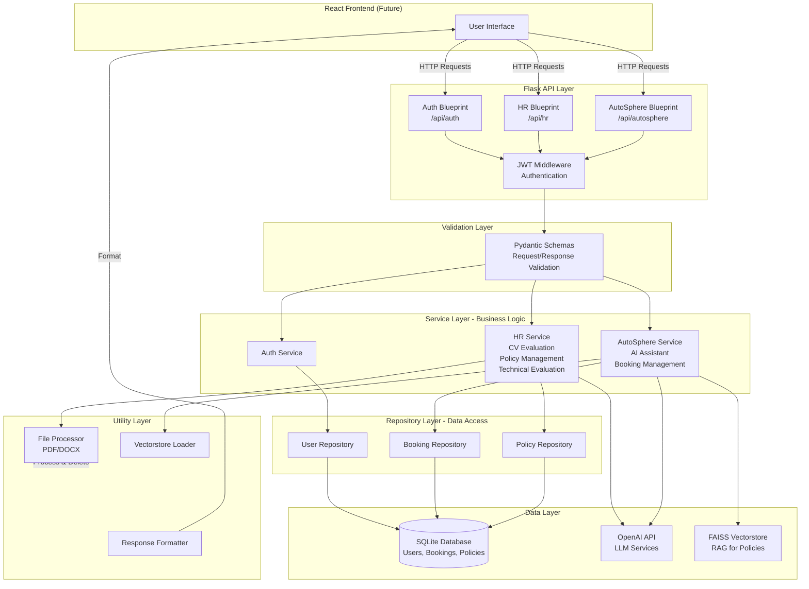
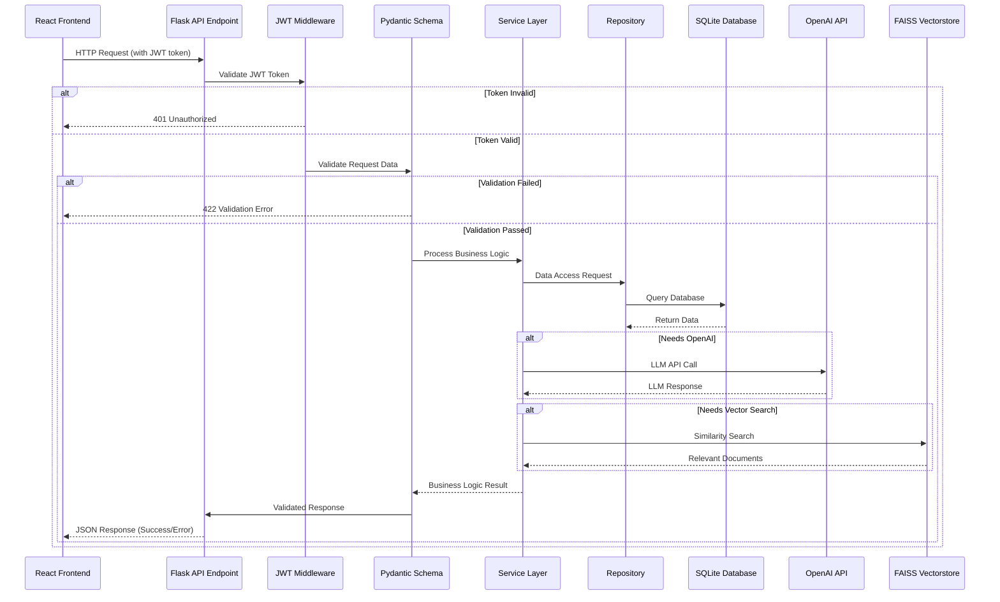
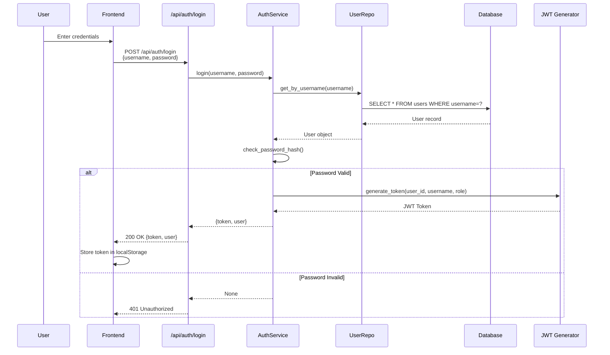
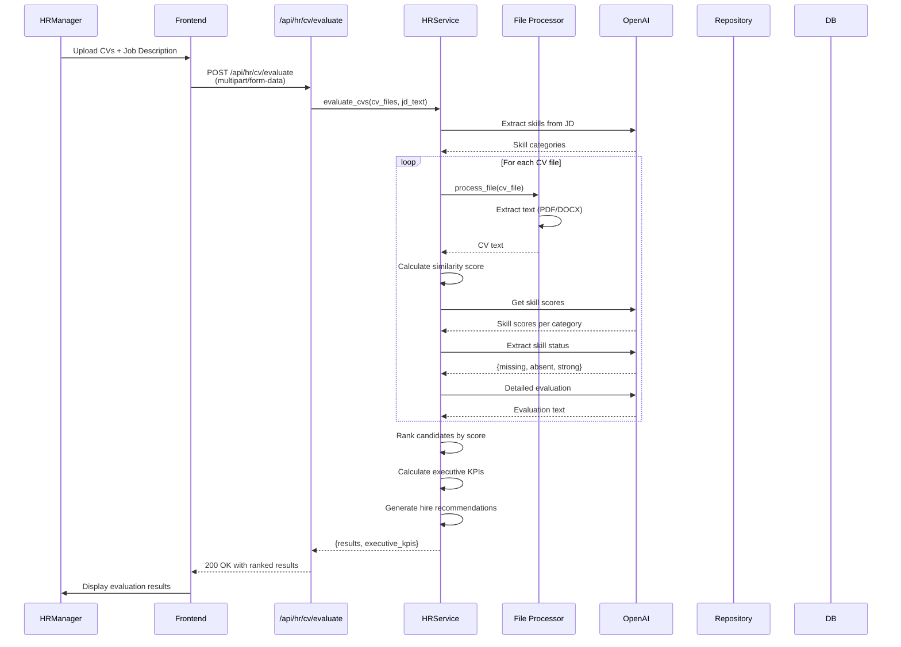
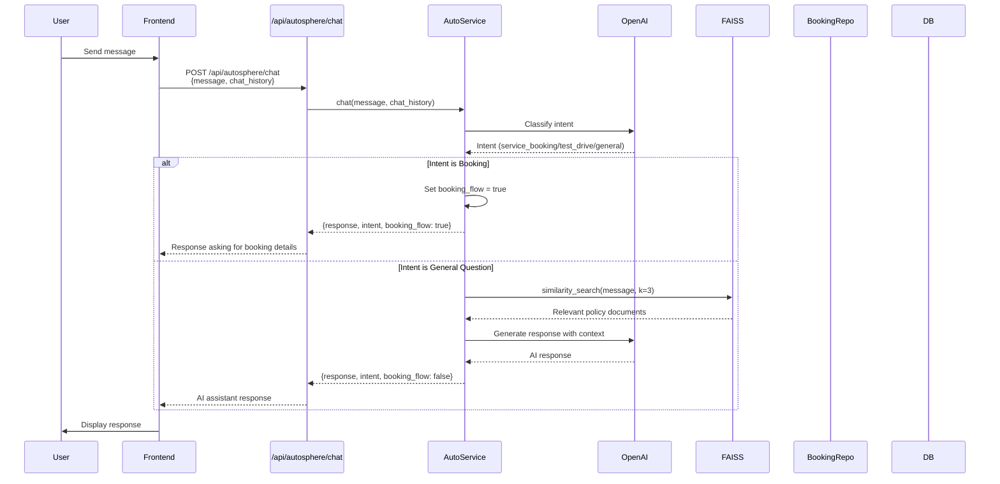

# Enterprise AI Dashboard - HR & AutoSphere Motors (Flask API)

A Flask REST API with two main applications:
1. **HR AI Platform** - CV evaluation, policy management, and technical assessments
2. **AutoSphere Motors AI** - AI assistant for automotive services and bookings

## Features

### HR AI Platform
- **CV Evaluation**: Upload candidate CVs and match them against job descriptions
- **Policy Management**: Upload and manage HR policy documents
- **Technical Evaluation**: Generate and evaluate technical interview questions
- **Employee Portal**: Ask questions about HR policies

### AutoSphere Motors AI
- **AI Assistant**: Chat-based assistant for automotive queries
- **Service Booking**: Book vehicle services through chat or form
- **Test Drive Booking**: Schedule test drives
- **Booking Search**: Search existing bookings by ID, phone, or type

## Architecture Overview

The application follows a **clean architecture** pattern with clear separation of concerns:

```
┌─────────────────────────────────────────────────────────────┐
│                    React Frontend (Future)                   │
└──────────────────────────┬──────────────────────────────────┘
                           │ HTTP/REST API
                           ▼
┌─────────────────────────────────────────────────────────────┐
│                    Flask API Layer                           │
│  ┌──────────────┐  ┌──────────────┐  ┌──────────────┐     │
│  │  Auth API    │  │   HR API     │  │ AutoSphere   │     │
│  │  Blueprint   │  │  Blueprint   │  │   Blueprint  │     │
│  └──────┬───────┘  └──────┬───────┘  └──────┬───────┘     │
│         │                 │                  │              │
│         └─────────────────┼──────────────────┘              │
│                           │                                  │
│                    ┌──────▼──────┐                          │
│                    │  Middleware │                          │
│                    │  (JWT Auth) │                          │
│                    └──────┬──────┘                          │
└───────────────────────────┼──────────────────────────────────┘
                            │
┌───────────────────────────┼──────────────────────────────────┐
│                    Service Layer                              │
│  ┌──────────────┐  ┌──────────────┐  ┌──────────────┐       │
│  │ Auth Service │  │  HR Service  │  │ AutoSphere   │       │
│  │              │  │              │  │   Service    │       │
│  └──────┬───────┘  └──────┬───────┘  └──────┬───────┘       │
│         │                 │                  │                │
└─────────┼─────────────────┼──────────────────┼──────────────┘
          │                 │                  │
┌─────────┼─────────────────┼──────────────────┼──────────────┐
│  Repository Layer                                           │
│  ┌──────────────┐  ┌──────────────┐  ┌──────────────┐      │
│  │ User Repo    │  │ Booking Repo  │  │ Policy Repo   │      │
│  └──────┬───────┘  └──────┬───────┘  └──────┬───────┘      │
│         │                 │                  │                │
└─────────┼─────────────────┼──────────────────┼──────────────┘
          │                 │                  │
┌─────────┼─────────────────┼──────────────────┼──────────────┐
│  Data Layer                                                 │
│  ┌──────────────┐  ┌──────────────┐  ┌──────────────┐      │
│  │   SQLite     │  │   OpenAI     │  │   FAISS       │      │
│  │  Database    │  │     API      │  │ Vectorstore   │      │
│  └──────────────┘  └──────────────┘  └──────────────┘      │
└──────────────────────────────────────────────────────────────┘
```

## System Architecture Diagram



## Request Flow Diagram



## Authentication Flow



## CV Evaluation Flow



## AutoSphere Chat Flow



## Architecture

### Design Principles

- **Repository Pattern**: Clean separation of data access layer
- **Service Layer**: Business logic separated from API routes
- **Pydantic Validation**: Request/response validation at API boundary
- **JWT Authentication**: Secure token-based authentication
- **SQLite Database**: Lightweight database with automatic Excel migration
- **Layered Architecture**: Clear separation between API, Service, Repository, and Data layers

### Technology Stack

**Backend Framework:**
- Flask - Lightweight web framework
- Flask-SQLAlchemy - ORM for database operations
- Flask-CORS - Cross-origin resource sharing

**Authentication:**
- PyJWT - JWT token generation and validation
- Werkzeug - Password hashing utilities

**Validation:**
- Pydantic - Data validation and serialization

**AI/ML:**
- OpenAI API - LLM services (GPT-4o, GPT-4o-mini)
- LangChain - Vector store operations
- FAISS - Vector similarity search
- scikit-learn - Text similarity calculations

**File Processing:**
- PyPDF2 - PDF text extraction
- python-docx - DOCX text extraction

**Database:**
- SQLite - Lightweight relational database
- pandas - Data processing and Excel migration
- openpyxl - Excel file reading

## Setup

### Prerequisites
- Python 3.9+
- OpenAI API key

### Installation

1. Clone the repository:
```bash
git clone <your-repo-url>
cd hr-demo-python
```

2. Create virtual environment (recommended):
```bash
python -m venv .venv
source .venv/bin/activate  # On Windows: .venv\Scripts\activate
```

3. Install dependencies:
```bash
pip install -r requirements.txt
```

4. Set up configuration:
You can configure the app using either `secrets.toml` or `.env` file:

**Option 1: Using secrets.toml (recommended)**
Create a `secrets.toml` file in the project root:
```toml
OPENAI_API_KEY=your_openai_api_key_here
JWT_SECRET_KEY=your_secret_key_here
DATABASE_URL=sqlite:///hr_demo.db
FLASK_ENV=development
```

**Option 2: Using .env file**
Create a `.env` file in the root directory:
```env
OPENAI_API_KEY=your_openai_api_key_here
JWT_SECRET_KEY=your_secret_key_here
DATABASE_URL=sqlite:///hr_demo.db
FLASK_ENV=development
```

**Note:** The app will check `secrets.toml` first, then environment variables. Both files are in `.gitignore` to protect your secrets.

5. Run the application:
```bash
python run.py
```

The API will be available at `http://localhost:5000`

## API Endpoints

### Authentication
- `POST /api/auth/login` - Login and get JWT token
  - Request: `{"username": "string", "password": "string"}`
  - Response: `{"token": "jwt_token", "user": {...}}`

### HR AI Platform

#### CV Evaluation
- `POST /api/hr/cv/evaluate` - Evaluate multiple CVs against job description
  - **Method**: POST
  - **Content-Type**: multipart/form-data
  - **Headers**: `Authorization: Bearer <token>`
  - **Body**:
    - `job_description` (string): Job description text
    - `cv_files` (file[]): Multiple PDF/DOCX files
  - **Response**: Ranked list with similarity scores, skill analysis, hire recommendations, executive KPIs

#### Policy Management
- `POST /api/hr/policy/upload` - Upload policy documents (HR Manager only)
  - **Method**: POST
  - **Content-Type**: multipart/form-data
  - **Headers**: `Authorization: Bearer <token>` (HR Manager role required)
  - **Body**: `policy_files` (file[]): Multiple PDF files
  - **Response**: Upload confirmation with document count

- `POST /api/hr/policy/ask` - Ask question about HR policies
  - **Method**: POST
  - **Content-Type**: application/json
  - **Headers**: `Authorization: Bearer <token>`
  - **Body**: `{"question": "string"}`
  - **Response**: `{"answer": "string"}` - Answer based on uploaded policies

#### Technical Evaluation
- `POST /api/hr/technical/generate-questions` - Generate technical questions (HR Manager only)
  - **Method**: POST
  - **Content-Type**: multipart/form-data
  - **Headers**: `Authorization: Bearer <token>` (HR Manager role required)
  - **Body**:
    - `job_description` (string): Job description text
    - `cv_file` (file): Candidate CV (PDF/DOCX)
  - **Response**: `{"questions": ["Q1", "Q2", ...]}` - List of 5 technical questions

- `POST /api/hr/technical/evaluate-answers` - Evaluate technical answers (HR Manager only)
  - **Method**: POST
  - **Content-Type**: application/json
  - **Headers**: `Authorization: Bearer <token>` (HR Manager role required)
  - **Body**: `{"questions": ["Q1", ...], "answers": ["A1", ...]}`
  - **Response**: Detailed evaluation with scores (0-20 per question) and overall feedback

### AutoSphere Motors AI

- `POST /api/autosphere/chat` - AI assistant chat
  - **Method**: POST
  - **Content-Type**: application/json
  - **Headers**: `Authorization: Bearer <token>`
  - **Body**: `{"message": "string", "chat_history": [...]}`
  - **Response**: `{"response": "string", "intent": "string", "booking_flow": boolean}`

- `POST /api/autosphere/bookings` - Create booking (Service or Test Drive)
  - **Method**: POST
  - **Content-Type**: application/json
  - **Headers**: `Authorization: Bearer <token>`
  - **Body**: 
    ```json
    {
      "booking_type": "Service" | "Test Drive",
      "name": "string",
      "phone": "string",
      "vehicle_model": "string",
      "preferred_date": "YYYY-MM-DD" (optional),
      "natural_language": "string" (optional - alternative to structured fields)
    }
    ```
  - **Response**: Booking confirmation with generated Booking ID

- `GET /api/autosphere/bookings` - Search bookings
  - **Method**: GET
  - **Headers**: `Authorization: Bearer <token>`
  - **Query Parameters**:
    - `booking_id` (optional): Search by booking ID
    - `phone` (optional): Search by phone number
    - `booking_type` (optional): Filter by "Service" or "Test Drive"
  - **Response**: List of matching bookings

- `GET /api/autosphere/bookings/{id}` - Get booking by ID
  - **Method**: GET
  - **Headers**: `Authorization: Bearer <token>`
  - **Response**: Single booking details

## Authentication

All endpoints (except `/api/auth/login`) require JWT authentication. Include the token in the Authorization header:

```
Authorization: Bearer <your_jwt_token>
```

### Token Structure
- **Algorithm**: HS256
- **Expiration**: 24 hours (configurable via `JWT_EXPIRATION_HOURS`)
- **Payload**: `{user_id, username, role}`

### Role-Based Access Control
- **HR Manager**: Full access to all HR endpoints
- **Employee**: Limited access (can ask policy questions, but cannot upload policies or generate technical questions)

## Project Structure

```
hr-demo-python/
├── app/
│   ├── __init__.py              # Flask app factory
│   ├── config.py                 # Configuration (reads secrets.toml/.env)
│   ├── database.py               # Database setup and Excel migration
│   │
│   ├── models/                   # SQLAlchemy models
│   │   ├── __init__.py
│   │   ├── user.py               # User model (username, password, role)
│   │   ├── booking.py            # Booking model (service/test drive)
│   │   └── policy_document.py     # Policy document model
│   │
│   ├── repositories/             # Repository pattern - Data access layer
│   │   ├── __init__.py
│   │   ├── base.py               # Base repository with CRUD operations
│   │   ├── user_repository.py    # User data access
│   │   ├── booking_repository.py # Booking data access
│   │   └── policy_document_repository.py # Policy data access
│   │
│   ├── services/                 # Service layer - Business logic
│   │   ├── __init__.py
│   │   ├── auth_service.py       # Authentication logic
│   │   ├── hr_service.py         # HR operations (CV eval, policies, technical)
│   │   └── autosphere_service.py # AutoSphere operations (chat, bookings)
│   │
│   ├── schemas/                  # Pydantic validation schemas
│   │   ├── __init__.py
│   │   ├── auth.py               # Login request/response
│   │   ├── booking.py             # Booking create/search schemas
│   │   ├── cv_evaluation.py      # CV evaluation schemas
│   │   ├── policy.py             # Policy upload/question schemas
│   │   ├── technical.py          # Technical evaluation schemas
│   │   └── chat.py               # Chat request/response schemas
│   │
│   ├── api/                      # Flask Blueprints - API routes
│   │   ├── __init__.py
│   │   ├── auth.py               # /api/auth endpoints
│   │   ├── hr.py                 # /api/hr endpoints
│   │   └── autosphere.py        # /api/autosphere endpoints
│   │
│   ├── middleware/               # Custom middleware
│   │   ├── __init__.py
│   │   └── auth.py               # JWT authentication decorators
│   │
│   └── utils/                    # Utility functions
│       ├── __init__.py
│       ├── openai_client.py      # OpenAI client wrapper
│       ├── file_processor.py     # PDF/DOCX processing (temporary)
│       ├── response.py           # Standardized response formatter
│       └── vectorstore.py        # FAISS vectorstore loader
│
├── run.py                        # Application entry point
├── requirements.txt              # Python dependencies
├── secrets.toml                  # Configuration (gitignored)
├── .env.example                  # Environment variables template
│
├── users.xlsx                    # User data (migrated to SQLite on first run)
├── bookings.xlsx                 # Booking data (migrated to SQLite on first run)
├── autosphere_policy.docx       # AutoSphere policy document for RAG
└── vectorstore/                  # FAISS vector store (auto-generated)
    ├── index.faiss
    └── index.pkl
```

## Data Flow

### Request Processing Flow

1. **Client Request** → Flask receives HTTP request
2. **JWT Middleware** → Validates authentication token
3. **Pydantic Validation** → Validates request data structure
4. **Service Layer** → Executes business logic
5. **Repository Layer** → Accesses database
6. **External APIs** → Calls OpenAI, FAISS as needed
7. **Response Formatting** → Standardized JSON response
8. **Client Response** → Returns to frontend

### Database Migration

On first application startup:
- SQLite database (`hr_demo.db`) is created automatically
- Data from `users.xlsx` is migrated to `users` table
- Data from `bookings.xlsx` is migrated to `bookings` table
- Migration only runs if tables are empty (prevents re-migration)

## Environment Variables

- `OPENAI_API_KEY` (Required): Your OpenAI API key for GPT models
- `JWT_SECRET_KEY` (Required): Secret key for JWT token signing
- `JWT_ALGORITHM` (Optional): JWT algorithm (default: HS256)
- `JWT_EXPIRATION_HOURS` (Optional): Token expiration time in hours (default: 24)
- `DATABASE_URL` (Optional): Database URL (default: sqlite:///hr_demo.db)
- `FLASK_ENV` (Optional): Flask environment (development/production)

## Database Schema

### Users Table
- `id` (Integer, Primary Key)
- `username` (String, Unique, Indexed)
- `password` (String, Hashed)
- `role` (String: "HR Manager" or "Employee")
- `created_at` (DateTime)

### Bookings Table
- `id` (Integer, Primary Key)
- `booking_id` (String, Unique, Indexed) - Format: AS-YYYYMMDD-XXXX
- `booking_type` (String: "Service" or "Test Drive")
- `name` (String)
- `phone` (String, Indexed)
- `vehicle_model` (String)
- `preferred_date` (Date, Optional)
- `created_at` (DateTime)

### Policy Documents Table
- `id` (Integer, Primary Key)
- `filename` (String)
- `content` (Text) - Extracted text from PDF
- `uploaded_at` (DateTime)
- `uploaded_by` (Integer, Foreign Key to Users)

## Usage Examples

### 1. Login
```bash
curl -X POST http://localhost:5000/api/auth/login \
  -H "Content-Type: application/json" \
  -d '{"username": "your_username", "password": "your_password"}'
```

Response:
```json
{
  "success": true,
  "message": "Login successful",
  "data": {
    "token": "eyJhbGciOiJIUzI1NiIsInR5cCI6IkpXVCJ9...",
    "user": {
      "id": 1,
      "username": "john_doe",
      "role": "HR Manager"
    }
  }
}
```

### 2. Evaluate CVs
```bash
curl -X POST http://localhost:5000/api/hr/cv/evaluate \
  -H "Authorization: Bearer <your_jwt_token>" \
  -F "job_description=We are looking for a Python developer..." \
  -F "cv_files=@candidate1.pdf" \
  -F "cv_files=@candidate2.pdf"
```

### 3. Chat with AutoSphere AI
```bash
curl -X POST http://localhost:5000/api/autosphere/chat \
  -H "Content-Type: application/json" \
  -H "Authorization: Bearer <your_jwt_token>" \
  -d '{"message": "What services do you offer?"}'
```

### 4. Create Booking
```bash
curl -X POST http://localhost:5000/api/autosphere/bookings \
  -H "Content-Type: application/json" \
  -H "Authorization: Bearer <your_jwt_token>" \
  -d '{
    "booking_type": "Service",
    "name": "John Doe",
    "phone": "+1234567890",
    "vehicle_model": "Toyota Camry",
    "preferred_date": "2024-12-25"
  }'
```

## Frontend Integration

This API is designed to be consumed by a React frontend. All responses follow a standardized format:

### Success Response
```json
{
  "success": true,
  "message": "Success message",
  "data": {
    // Response data here
  }
}
```

### Error Response
```json
{
  "success": false,
  "message": "Error message",
  "errors": [
    "Error detail 1",
    "Error detail 2"
  ]
}
```

### HTTP Status Codes
- `200` - Success
- `400` - Bad Request
- `401` - Unauthorized (invalid/missing token)
- `403` - Forbidden (insufficient permissions)
- `422` - Validation Error
- `500` - Internal Server Error

## Key Features Implementation

### CV Evaluation
- **Multiple CV Processing**: Handles multiple PDF/DOCX files in one request
- **Similarity Scoring**: Uses TF-IDF and cosine similarity
- **Skill Analysis**: AI-powered skill extraction and scoring per category
- **Hire Recommendations**: Intelligent recommendations based on scores and skill gaps
- **Executive KPIs**: Aggregated metrics for management dashboard

### Policy Management
- **Document Upload**: Multiple PDF uploads with text extraction
- **RAG (Retrieval Augmented Generation)**: Uses uploaded policies to answer questions
- **Role-Based Access**: Only HR Managers can upload policies

### Technical Evaluation
- **Question Generation**: AI generates 5 questions of increasing difficulty
- **Answer Evaluation**: Scores each answer (0-20) with detailed feedback
- **Overall Assessment**: Provides total score and comprehensive evaluation

### AutoSphere AI Assistant
- **Intent Classification**: Automatically detects booking vs. general questions
- **RAG Integration**: Uses FAISS vectorstore for policy-based answers
- **Booking Flow**: Seamless transition from chat to booking
- **Natural Language Processing**: Extracts booking details from free-form text

## Security Considerations

- **JWT Tokens**: Secure token-based authentication
- **Password Hashing**: Uses Werkzeug's secure password hashing
- **Role-Based Access**: Endpoints protected by role requirements
- **Input Validation**: All inputs validated via Pydantic schemas
- **File Processing**: Temporary file processing with automatic cleanup
- **Secrets Management**: Configuration files in `.gitignore`

## Performance Considerations

- **Database Indexing**: Username, booking_id, phone are indexed
- **Lazy Loading**: Vectorstore loaded only when needed
- **Temporary Files**: Files processed and deleted immediately
- **Connection Pooling**: SQLAlchemy handles database connections efficiently

## Future Enhancements

- [ ] PostgreSQL support for production
- [ ] Redis caching for frequently accessed data
- [ ] Rate limiting for API endpoints
- [ ] WebSocket support for real-time chat
- [ ] File storage in cloud (S3) instead of temporary processing
- [ ] Advanced analytics and reporting
- [ ] Email notifications for bookings
- [ ] Multi-language support

## Troubleshooting

### Common Issues

1. **OPENAI_API_KEY not found**
   - Ensure `secrets.toml` or `.env` file exists with the key
   - Check file is in project root directory

2. **Database migration errors**
   - Ensure Excel files (`users.xlsx`, `bookings.xlsx`) exist
   - Check file format matches expected structure

3. **JWT token expired**
   - Tokens expire after 24 hours (configurable)
   - Re-login to get a new token

4. **Vectorstore not found**
   - First run will create vectorstore from `autosphere_policy.docx`
   - Ensure the file exists in project root

## License

This project is for demonstration purposes.
